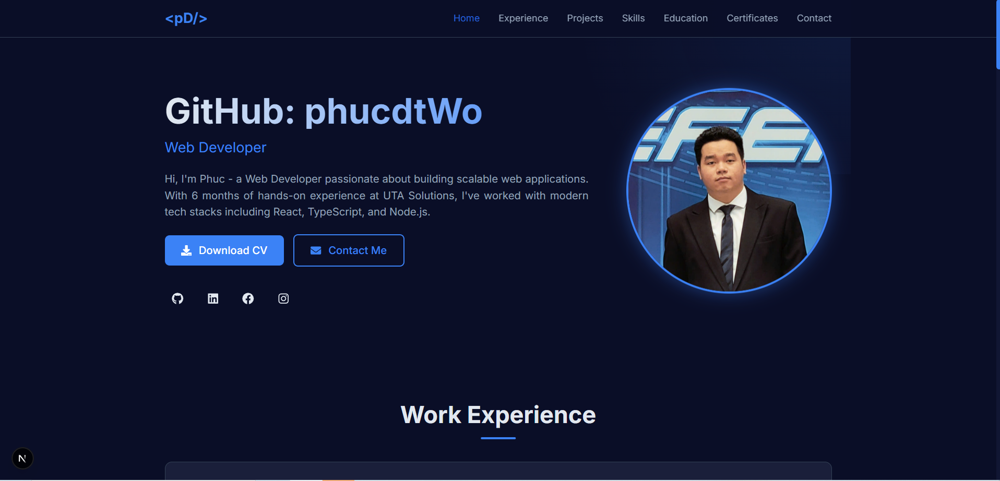

# 🌟 Portfolio

Personal portfolio website built with **Next.js**, **TypeScript**, and **Tailwind CSS** — showcasing my experience, projects, skills, and certificates.

---

## 🚀 Tech Stack

- **Framework:** Next.js
- **Language:** TypeScript
- **Styling:** Tailwind CSS
- **Deployment:** Vercel

---

## ✨ Features

- Responsive, modern design
- Smooth navigation between sections
- Display of key sections:
  - 🏠 Home
  - 💼 Experience
  - 🧩 Projects
  - ⚙️ Skills
  - 🎓 Education
  - 📜 Certificates
  - 📧 Contact
- Integrated contact form — allows visitors to send email directly
- Optimized for performance and SEO

---

## 🖼️ Screenshots



## ⚙️ Setup

Clone this repository and install dependencies:

```bash
git clone https://github.com/<your-username>/portfolio.git
cd portfolio
npm install
npm run dev
```
